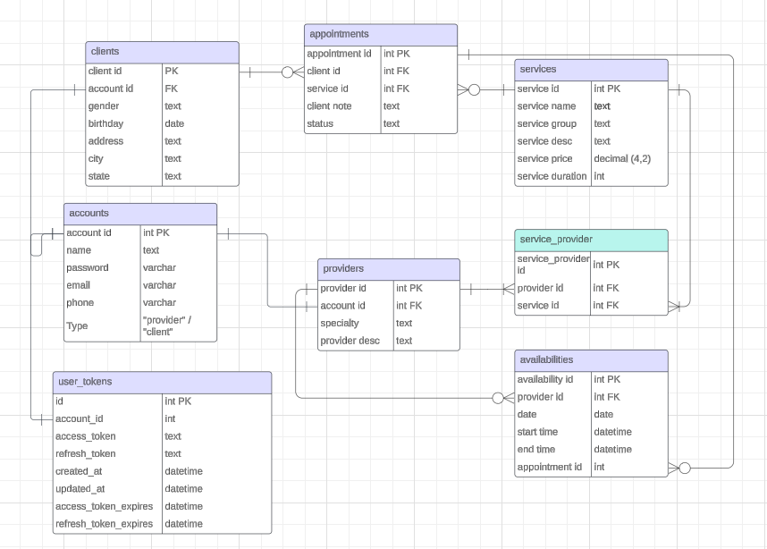
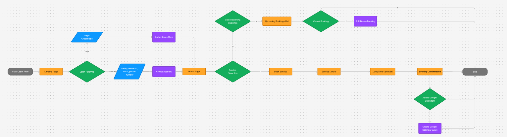
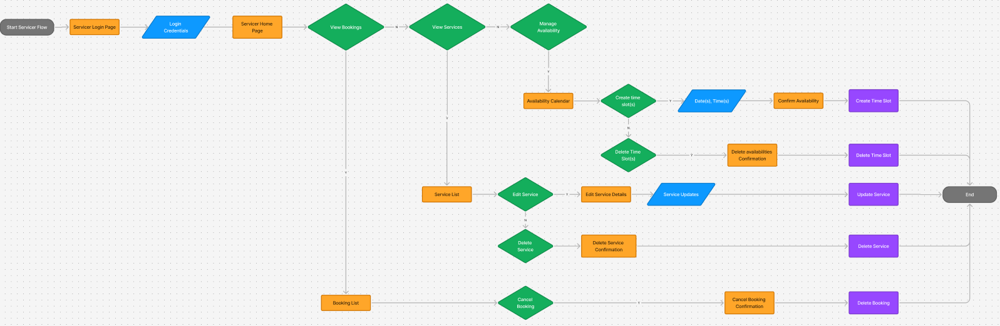

# Appointment Booker Documentation

## URL

## Project Summary
This applcation is a custom appointment booking application for my wifes lash extension and permanent make-up business. This applicaiton allows users to create an acccount with her business, set up a profile, and book appointments through it. The clients can then manage their appointments through the home page appointments list (i.e. cancel them). 

If the client chooses to, they can sync their account to Google Calendar so that every time they book an appointment, a corresponding Google calendar event will be created in their Google account. The user must first go to the Google Calendar Settings page and initiate the Google authentication process to give this application permission to access their Google accounts calendar data.

The access and refresh tokens are encrypted so that they are not stored in the applications database exposed. Just like their login passwords, all access keys are secured and unretrievable by anyone.

The calendar visualziation feature is created from scratch using React components, allowing for full customzation of the calendar view for this business.

## Installation Instructions
1. Upon cloning this repo to your local machine, ensure that you first download all requirements by running the following command in the root of the project directory:

    pip install -r requirements.txt

2. Make sure to run the setup.sql script to setup the database.

3. Run the appointment-booker-seed.sql file to pre-populate the database with necessary data to make the application usable.

4. Start the server first by navigating to the "server" folder and running the following command:

    nodemon server.js

5. Start the front end by navigating to the "appointment-booker" folder and running the following command:

    npm run dev

## Tools Used for this application:

### Technology Stack
- HTML
- CSS
- JavaScript
- Node.js
- Express
- React.js

### Database
- PostgreSQL

### APIs
- Google Calendar API

### Front End Tools and Libraries
- Material UI
- Bootstrap
- Axios
- Toastify
- Reactstrap
- Vite

## Back End Tools and Libraries
- crypto
- bcrypt
- googleapis
- jsonschema
- jsonwebtoken
- pg

## Database ERD Diagram:

## User Flow Diagram:

## Additional Notes
- The back end is built out with extra routes and model functions with the intention to build extra features in the near future
- Additional features planned to be added to this application are included in Appendix A

## Appendix A - Future Feature Builds
### Provider Flows:
- Provider Login
- Set Availabilities
- Accept Booking
- Manage Services
- Provider Cancelled Bookings
- Twilio Integration for email Notifications

### Service Enhancements
- Service Hierarchy Expansion (Sub-Services)

### Model Enhancements
- Availability Model Updates: Flexible Time Blocks Instead of 1 Hour Time Blocks

## Appendix B - Proposed Provider User Flow Diagram
